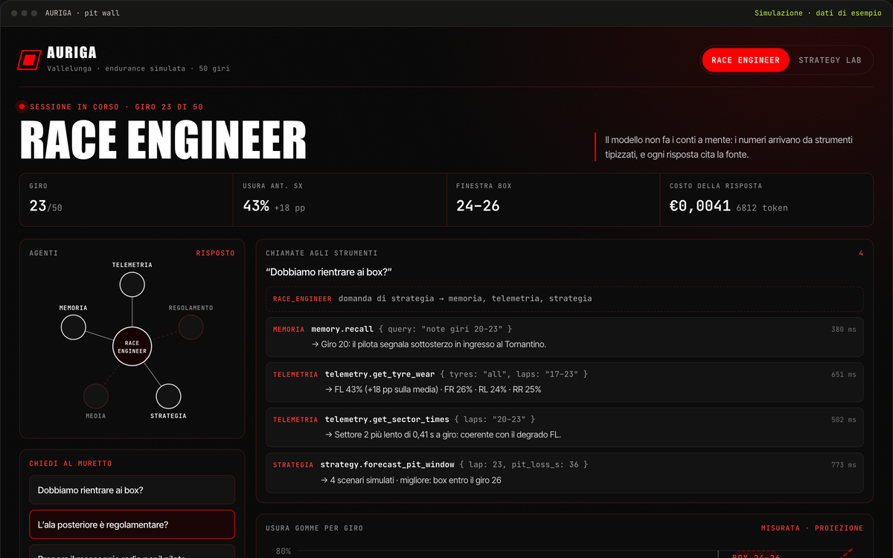

# AURIGA

> Un ingegnere di pista AI: legge la telemetria, cita il regolamento e simula la gara prima di consigliare il pit stop.

`02` · **Hackathon Oracle × Scuderia Tor Vergata** · 2026 · Progettazione e sviluppo

[**▶ Prova la demo**](https://portfolio.lele-tradevalue.com/progetti/auriga/#demo) · [Caso studio completo](https://portfolio.lele-tradevalue.com/progetti/auriga/) · [English version](https://portfolio.lele-tradevalue.com/en/progetti/auriga/)

## Il problema

In una gara endurance le decisioni si prendono in pochi secondi: rientrare adesso o fra tre giri? Quel componente è regolamentare? Cosa dico al pilota? I dati ci sono — telemetria, regolamento, dossier tecnico — ma sono sparsi, e nessuno può leggerli tutti mentre la macchina gira.

## Cosa ho costruito

Per la AI Race Engineer Challenge di Oracle con la Scuderia Tor Vergata ho costruito AURIGA: un supervisore che smista ogni domanda a cinque specialisti — telemetria, regolamento, strategia, comunicazione e memoria del team. Ognuno lavora con i propri strumenti e l’interfaccia mostra in diretta chi sta facendo cosa. Alla fine arriva una sola raccomandazione, con le sue fonti: i giri analizzati, l’articolo del regolamento, la simulazione eseguita.

## Come funziona

1. **La domanda** — Il muretto chiede in linguaggio naturale: «Dobbiamo rientrare?».
2. **Lo smistamento** — Il supervisore sceglie gli specialisti che servono e li fa lavorare insieme.
3. **Strumenti, non intuizioni** — Usura per giro, finestre di pit stop, verifica dei componenti: i numeri arrivano da strumenti tipizzati, mai dalla fantasia del modello.
4. **La simulazione** — Un motore Monte Carlo corre migliaia di gare con il regolamento di punteggio della competizione e confronta le strategie.
5. **La raccomandazione** — Una risposta sola, motivata e citata: «box tra il giro 24 e il 26».

## Perché funziona

- **Il modello non fa i conti a mente.** Strategia e consumi passano sempre da un simulatore con le formule di punteggio reali.
- **Ogni verdetto cita l’articolo.** La verifica di un componente restituisce misura, limite, sezione del regolamento ed esito.
- **Tutto visibile in diretta.** Costellazione degli agenti, chiamate agli strumenti e costi scorrono in tempo reale.
- **Onesto sul perimetro.** Costruito e provato sulla gara simulata dell’hackathon, non su dati reali di pista.

## In numeri

| | |
|---:|---|
| **6** | agenti: 1 supervisore + 5 specialisti |
| **16** | strumenti MCP |
| **50** | giri di gara simulata |
| **5.000** | simulazioni per prova nella demo |

## Stack

`Python` `FastAPI` `React` `TypeScript` `NumPy` `MCP` `Oracle OCI`

## Cosa resta privato

La gara è quella simulata fornita dall’hackathon. La demo espone lo Strategy Lab con il motore originale sul server; agenti, prompt e servizi Oracle restano privati. Questo repository contiene solo la presentazione del progetto: niente codice sorgente, cronologia o configurazioni.

<b>In English</b>

**AURIGA** — An AI race engineer: it reads the telemetry, cites the rulebook and simulates the race before recommending a pit stop.

For Oracle’s AI Race Engineer Challenge with Scuderia Tor Vergata I built AURIGA: a supervisor that routes every question to five specialists — telemetry, rules, strategy, communications and team memory. Each works with its own tools, and the interface shows live who is doing what. What comes back is a single recommendation with its sources: the laps analysed, the rule article, the simulation that was run.

- **The model never does maths in its head.** Strategy and fuel always go through a simulator using the real scoring formulas.
- **Every verdict cites the rule.** A component check returns the measurement, the limit, the rule section and the outcome.
- **Everything visible live.** Agent constellation, tool calls and costs stream in real time.
- **Honest about scope.** Built and tested on the hackathon’s simulated race, not on real track data.

[Read the full case study and try the demo →](https://portfolio.lele-tradevalue.com/en/progetti/auriga/)

---

Emanuele Montalto · [portfolio](https://portfolio.lele-tradevalue.com) · [LinkedIn](https://www.linkedin.com/in/emanuele-montalto/) · [montalto36@gmail.com](mailto:montalto36@gmail.com)
